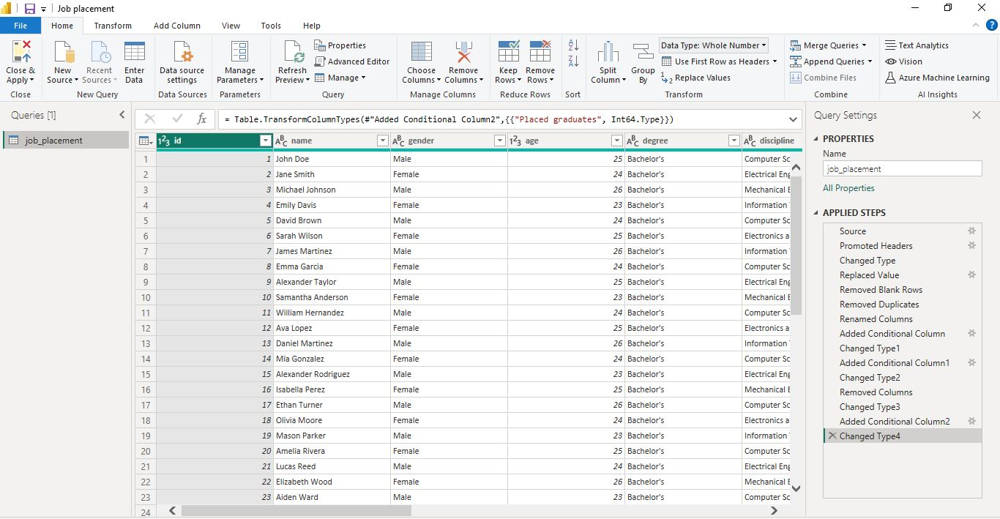
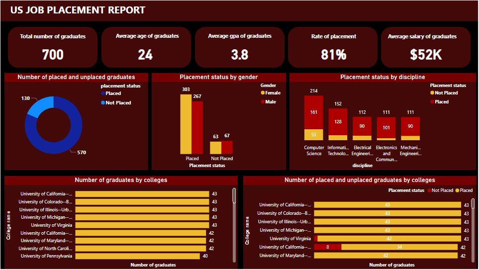

# 
 US Job placement analysis 

# 

## 
 INTRODUCTION 

This project is a group project and it forms part of my coursework in the SkillHarvest Data Analysis Bootcamp. In this project, I explored the employment outcomes of a recent survey of Bachelor's degree graduates in the United States. The dataset includes information such as gender, age, field of study, university name, placement status, salary upon placement, GPA, and years of experience. Using PowerBI, I conducted an in-depth analysis to understand factors influencing placement rates, compare placement outcomes across different universities and fields of study, and analyze the relationship between salary and academic performance. The project involved data exploration, visualization, creation, and insights generation to provide valuable insights into the employment landscape for Bachelor's degree graduates.
## 
 Aims and objectives 

This project aims to analyze the employment outcomes of recent Bachelor's degree graduates in the United States and provide valuable insights into factors influencing placement rates, salary distributions, and other relevant factors. The objectives include exploring the dataset to understand its structure and variables, conducting descriptive analysis to summarize key statistics and distributions, creating visualizations to represent placement outcomes and trends, comparing placement outcomes across universities and fields of study, analyzing the relationship between salary upon placement and academic performance (GPA), and generating actionable insights and recommendations to improve career services, curriculum development, and recruitment strategies for Bachelor's degree graduates.
## 
 Problem statement 

The transition from academia to the workforce is a critical phase for recent Bachelor's degree graduates, yet there is limited understanding of the factors influencing their employment outcomes. This project aims to address this gap by analyzing a dataset of Bachelor's degree graduates in the United States to understand placement rates, salary distributions, and other factors affecting their employment. By identifying patterns and trends in the data, the project seeks to provide insights that can inform decision-making for students, universities, and employers, ultimately improving the employment prospects and career success of Bachelor's degree graduates.
## 
 Data sourcing 

The data for this analysis was sourced from online databases containing information on recent Bachelor's degree graduates in the United States.
## 
 Data transformation/cleaning 

The data was efficiently cleaned and transformed with the power query editor of powerbi. Some of the applied steps includes the following;
- deleted blank spaces
- replaced null values
- renamed the 'stream' column to 'discipline'
- checked for duplicates
- changed the datatype of the years of experience column from 'TEXT' to 'WHOLE NUMBER'
- added a conditional column 
## 

## 
 Data visualization 

For data visualization, Power BI was utilized to create interactive and visually engaging representations of the analysis findings.
# 

## 
 Data presentation 

To present my analysis, I have created a video using Loom, a screen recording and video messaging tool to provide a comprehensive overview of the analysis findings of my data. You can view the video presentation [here](https://www.loom.com/share/fa0cb3a8e022491cb7453e6a39b50fc6?sid=c78e8612-f84c-4481-aff4-57cc69d2a169).
## 
 Insights from data 

- Out of the 700 graduates surveyed, 570 were successfully placed into employment, while 130 graduates did not secure placement, giving a placement rate of 81%.
- Among the 570 graduates who were successfully placed into employment, 303 were female, and 267 were male.
- Out of the 700 graduates surveyed, 214 studied computer science, 152 studied information technology, 112 studied electrical engineering, 111 studied electronics and communication engineering, and 111 studied mechanical engineering.
- Among the graduates surveyed, those who studied computer science had the highest placement rate, with 161 graduates successfully placed into employment. In contrast, mechanical and electrical engineering graduates had the lowest placement rates, with 90 graduates from each discipline securing employment.
- Despite having the highest placement rate, computer science also has the highest number of unplaced graduates. This suggests that a significant proportion of the surveyed graduates studied computer science.
- Among the surveyed graduates, the University of California, University of Colorado, University of Illinois, University of Michigan, and University of Virginia have the highest number of graduates as well as highest number of placed graduates. This observation may be attributed to the popularity of these universities or their strong academic reputations, which attract a large number of students.
## 
 Recommendations 

- To improve employment outcomes for graduates in mechanical and electrical engineering, it is recommended to implement targeted career development programs and networking opportunities tailored to these disciplines. Collaborating with industry partners to provide internships, co-op programs, or experiential learning opportunities can also help students gain practical skills and enhance their employability.
- To address the high number of unplaced graduates in computer science, it is recommended to review the curriculum and career services offerings to ensure alignment with industry needs and market demand. Providing opportunities for practical experience, such as internships or project-based learning, can enhance students' employability and help them secure placement upon graduation.
- To support the career aspirations of graduates from universities with high enrollment numbers, it is recommended to enhance career services offerings, such as job fairs, networking events, and alumni connections, to facilitate employment opportunities.
- To address the employment challenges faced by graduates from universities with lower enrollment numbers, the education board can conduct a review of factors influencing placement rates at these institutions. This review may include an assessment of academic syllabi to ensure alignment with industry needs, as well as the creation of programs and initiatives aimed at enhancing the employability of graduates.
## 
 Conclusion 

In conclusion, the analysis of employment outcomes for recent Bachelor's degree graduates in the United States has provided valuable insights into placement rates, salary distributions, and factors influencing career trajectories. Despite variations in placement rates across universities and fields of study, common themes emerge, such as the importance of practical experience, industry alignment, and career services support in facilitating successful transitions to the workforce. By addressing these challenges and leveraging opportunities for collaboration between educational institutions, industry partners, and government agencies, it is possible to improve employment outcomes and enhance the overall career success of Bachelor's degree graduates.
